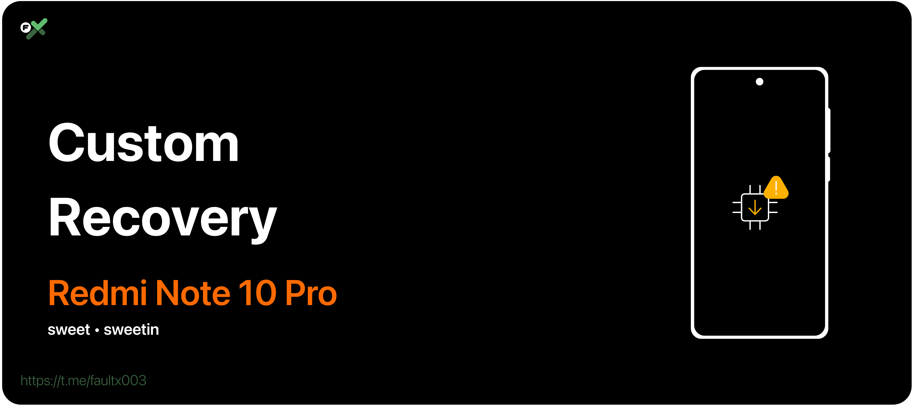

# Custom Recovery
```
Device : Redmi Note 10 Pro / Pro Max
Codename: sweet / sweetin
```

| Android Version | Recovery | Maintainer | Link |
|  :---: |---|---|---|
| 11 - 12 | TWRP Official | Nebrassy | [Download](https://dl.twrp.me/sweet/) |
| 11 - 12 | OrangeFox Official | Royal_King_0 | [Download](https://orangefox.download/device/sweet) |
| 12 - 13 | KewL TWRP | Pulkit | [Download](https://sourceforge.net/projects/android-sweet/files/recovery/) |
| 12 - 13 | TWRP Unofficial | Aryan | [Download](https://sourceforge.net/projects/twrp-releases/files/Sweet/) |
| 12 - 13 | OrangeFox Unofficial | Aryan | [Download](https://sourceforge.net/projects/orangefox-releases/files/sweet/) |
| 14 - 15 | OrangeFox Unofficial | Aryan | [Download](https://github.com/basamaryan/android_device_xiaomi_sweet-TWRP/releases/) |

---
[**← Back**](https://github.com/TriHermawan/RedmiNote10Pro?tab=readme-ov-file#table-of-contents)
